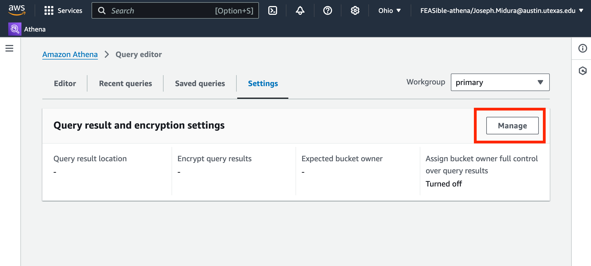
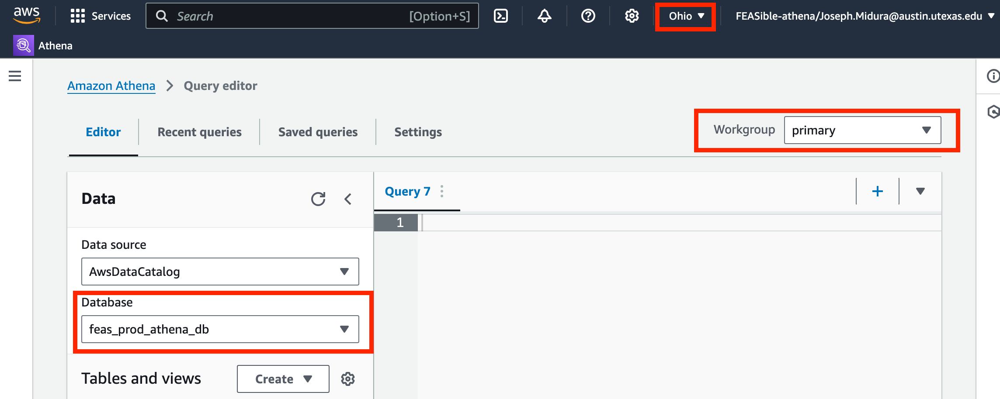

# Connect to AWS Athena

AWS Athena is a SQL query editor that will allow you to retrieve data from the database.

## 1. Login with UT EID and password
You will be able to log into AWS using your UT EID and password. Direct login link: https://utexas.awsapps.com/start#/

## 2. AWS access portal page
The AWS access portal page has an orange icon. Select the label "KHED-feasible-main" 
and then the "FEASible-athena" link.

## 3. AWS console page
Now you are signed into AWS and are on the main console landing page. You will see 
that many things are disabled for you. Use the search bar at the top left to search 
for "Athena." 

## 4. Create a shortcut to Athena
Click the star icon to create a shortcut to the Athena query editor and then select
the Athena option to go to the Athena query editor.

## 5. One time setup of Athena settings 
The Athena query editor is where you will have access to collected Fitbit data. 
On the main Athena window, the first thing to do is adjust default settings. This 
is a one time task and one I expect to automate for users in the future. Select 
the settings option from the navigation bar on top of the page.

## 6. Select manage settings button

## 7. Select query location
Click browse and select "feas-prod-athena-queries."

## 8. Set default encryption
Click "Encrypt query results" and keep the default option. Your settings should 
look like the picture below. Click save.

## 9. Select editor tab
Choose the editor tab from the navigation bar to go back to the editor screen.

## 10. Final setup
Make sure your region is US East (Ohio), your workgroup is "primary" and that the 
database selection is "feas_prod_athena_db." These options will be auto selected 
for you in the future. 

## 11. Query the data
You will now see the data tables you are able to query on the left side of the 
screen. There are a couple SQL queries to get you started on the "saved queries" 
tab on the navigation bar. The "download results" button will allow you to save 
the results of a query in CSV format.

## 12. Save queries you write
You can write your own queries and save them. Use the three vertical dots hidden 
menu next to the query number to save queries you want to use again.

